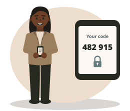

# Session 11.4: Proving who you are

**Day 2, 1:00 to 3:00. Test 2 is at 3:00.** On the map of the six jobs of security, this afternoon is still about **Protect**: protecting our accounts.

[Back to the course site](../index.html)

---

## A deleted order

A customer order was deleted at 11:14 pm. Everyone in accounts uses the same login: `accounts1`. Who did it? Nobody can tell. This afternoon you will learn why, and how to fix it.

## This afternoon you will learn

1. Extended CIA.
2. Strong passwords.
3. MFA.

---

## 1. Extended CIA

### What we know

| Letter | Word | Question |
|---|---|---|
| C | Confidentiality | Was it **seen** by the wrong person? |
| I | Integrity | Was it **changed** wrongly? |
| A | Availability | Could we **not use** it? |

### What we add today

This morning's tricks showed two problems that CIA does not name. So we add two more goals.

| Letters | Word | Question | TeaLeaf example |
|---|---|---|---|
| Au | **Authenticity** | Is it **really** you, or really from them? | The fake supplier email and the fake MD voice fail authenticity |
| Ac | **Accountability** | Can we tell **who** did it? | The deleted order with a shared login fails accountability |

**CIA + Authenticity + Accountability = extended CIA.**

### How we get them

| Tool | Question | Gives |
|---|---|---|
| **Authentication** | Who are you? (a password and a code) | Authenticity |
| **Authorisation** | What may you do? (Kasun may open Accounts, not Payroll) | Limits the harm |
| **A personal login for everyone, plus a log** | Who did it? | Accountability |

Authentication and authorisation sound alike. **Authentication** is the check at the door. **Authorisation** is which rooms you may enter.

## 2. Strong passwords

Passwords fail when they are **used everywhere**, **easy to guess** (names, birthdays, "123456"), **shared**, or **written down**.

**Length beats tricks.** Swapping a for @ does not fool anyone: attackers try those swaps first.

| Password | Why | Time to guess (estimate) |
|---|---|---|
| tealeaf123 | Common and short | Less than a second |
| P@ssw0rd! | Symbols swapped into a common word | Less than a second |
| river-lamp-cloud-seven | Four random words | Years |
| river-lamp-cloud-seven-mango | Five random words | Hundreds of thousands of years |

*Estimates assume a fast computer guessing 10 billion passwords a second.*

A **passphrase** is a password made of several random words. It is long, and easy to remember.

A **password manager** is an app that makes a strong, different password for every website and remembers them all. You remember one master passphrase.

## 3. MFA

**MFA (multi-factor authentication)** means logging in with two or more **different** kinds of factor.

| Kind of factor | Examples |
|---|---|
| Something you **know** | A password, a passphrase, a PIN |
| Something you **have** | Your phone, a security key, a bank card |
| Something you **are** | Your fingerprint, your face |

A criminal buys Kasun's stolen password, but does not have his phone. **The criminal is stopped.**

> **A password + a PIN is NOT MFA.** Both are something you know.

> **Never share the code.** A code from your phone is a key. The bank, IT and the MD will never ask for it. If anyone asks, say no and report it.

> **Good to know (not in the test):** **least privilege** means people get only the access their job needs. **Leavers** must lose every login on their last day. **Zero trust** means checking every time, even with the right password.

---

## Games for this session

- [A1.1+ Extended CIA Triage](../artifacts/day2/a1-1-plus-extended-cia-triage.html): the Day 1 game with two new goals.
- [A2.4 Password Lab and MFA Gauntlet](../artifacts/day2/a2-4-password-lab-mfa-gauntlet.html): test made-up passwords (never a real one), then stop the attacker.
- [A2.5 Access Office](../artifacts/day2/a2-5-access-office.html): find who deleted the order, give the right access, check every login.
- [A2.6 People Words Ladder](../artifacts/day2/a2-6-people-words-ladder.html): all thirteen words of the day. Tap **Hear it** to hear each word.

## Check yourself

1. A fake email pretends to come from TeaLeaf's bank. Which goal of extended CIA does it attack?

Authenticity. The email is not really from the bank.

2. What is the difference between authentication and authorisation?

Authentication proves who you are. Authorisation is what you are allowed to do after you log in.

3. Kasun's login uses a password and a fingerprint. Is this MFA? Why?

Yes. A password is something he knows; a fingerprint is something he is. Two different kinds of factor.

## Test 2: how it works

At 3:00 you answer **two questions** on paper, one about the morning and one about the afternoon. Each question gives a short TeaLeaf situation and asks you to decide something and say why.

1. **Write** (35 min). No books, no phones.
2. **Photo** (5 min). Take clear photos. Make one PDF.
3. **Upload** (10 min) to the LMS. File name: `DBIS11_StudentID_Day2.pdf`
4. **Hand in** (5 min) your paper to the lecturer before you leave.

We mark your **ideas**, not your grammar. To prepare, play the People Words Ladder and the Bank Change Trap again.

## Words to know

| Word | Simple meaning |
|---|---|
| Authenticity | Being sure it is really you, or really from them |
| Accountability | Being able to tell who did something |
| Authentication | Proving who you are, for example with a password and a code |
| Authorisation | What you are allowed to do after you log in |
| Passphrase | A password made of several random words |
| Password manager | An app that makes and remembers strong passwords for you |
| MFA | Logging in with two or more different kinds of factor |

**Previous:** [Session 11.3: Tricks that target people](11-03.html)

DBIS-11 Cybersecurity and Cloud Computing. &copy; 2026 Niranga Dharmaratna. This work is licensed under <a href="https://creativecommons.org/licenses/by-nc-sa/4.0/">CC BY-NC-SA 4.0</a>. Illustrations are original and share the same licence. <a href="../LICENSE.html">Licence details</a>.

